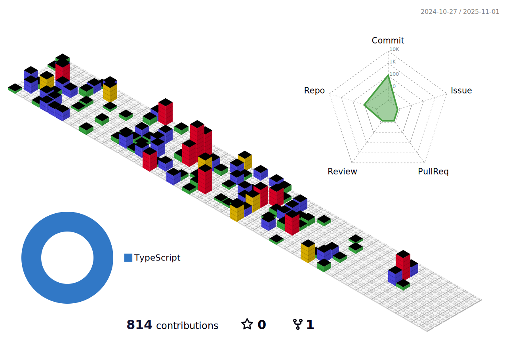

# Welcome to my GitHub! 

I'm a Full-Stack Web Developer focused on building beautiful and responsive web applications. 

I've been working with technology since 2010, where I grew a interest in computers and electrinics. This led me to become an Aircraft Computer and Electronics Engineer. With time, I gained a  strong and deep passion for web development. During this time I worked with the most diverse types of projects. I have an interest in Virtual and Artificial Reality, Artificial Intelligence, Cyber Security and Machine Learning. 

## 🛠️Tech Stack
- 👩‍💻 Programming Languages, Frameworks, and Tools
  
    &nbsp;
    &nbsp;
    &nbsp;
    &nbsp;
    &nbsp;
    &nbsp;
    &nbsp;
    &nbsp;
    &nbsp;
    &nbsp;
    &nbsp;
    &nbsp;
    &nbsp;
    &nbsp;
    &nbsp;
    &nbsp;
    &nbsp;
    &nbsp;
    &nbsp;
    &nbsp;
    &nbsp;
    &nbsp;
    &nbsp;
    &nbsp;
    &nbsp;
    &nbsp;
    &nbsp;
    &nbsp;    
    &nbsp;
    &nbsp;
    &nbsp;
    &nbsp;
    &nbsp;
    &nbsp;

 

## 👩‍💻 About me
* I am Canadian living in Japan 
*  I Love Computers and Programming.
* &nbsp; My favorite programming language is Javascript 
* 👩‍🏫 I Love learning and sharing knowledge
* 🏞️ Traveling is one of my favorite hobbies, as you can see from the image above, 
* In my free time, you will find me in virtual reality flying realistic flight simulators.

 

